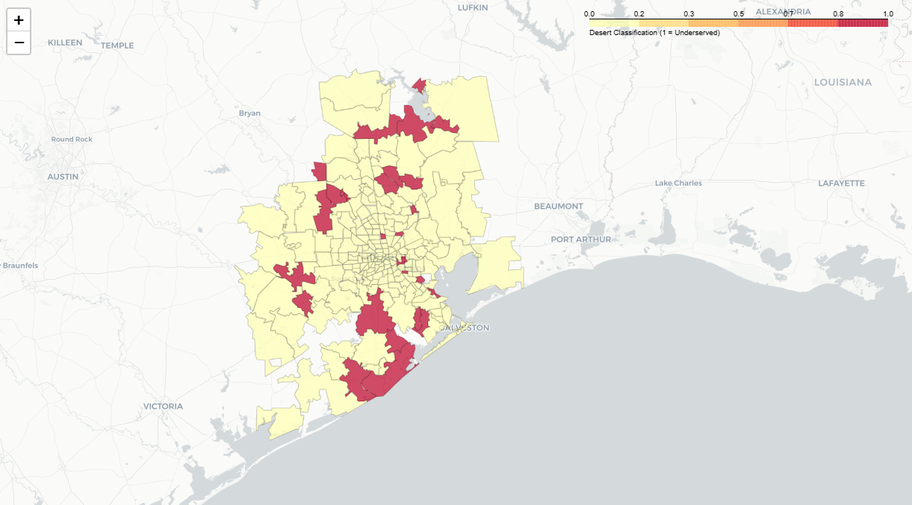

# Healthcare Accessibility & Demand Modeling

Identifying Healthcare Deserts in Houston, TX

## Overview

This project analyzes healthcare accessibility across Houston-area ZIP codes by identifying regions where demographic demand is high but healthcare facility availability is low.

The project simulates a real-world use case for a Healthcare Real Estate Investment Trust (REIT) evaluating where to expand healthcare infrastructure.

Using demographic data from the Census API and healthcare facility density metrics, I built a custom Logistic Regression model from scratch using NumPy to classify underserved areas ("healthcare deserts").

## Key Features

* Custom Logistic Regression implementation using NumPy
* Gradient Descent optimization from scratch
* Census API data acquisition pipeline
* Feature engineering and preprocessing workflow
* Benchmark comparison against Scikit-learn
* Geospatial visualization of underserved ZIP codes using Folium

## Tech Stack

* Python
* NumPy
* Pandas
* Scikit-learn
* Matplotlib
* GeoPandas
* Folium
* Census API

## Business Problem

Healthcare providers and healthcare-focused REITs need a way to identify areas where demand for healthcare services exceeds current infrastructure capacity.

This project models the relationship between:

* population demographics
* median age
* income
* healthcare facility density

to identify ZIP codes with high potential unmet healthcare demand.

## Methodology

### Data Pipeline

* Pulled demographic data from the Census API
* Aggregated healthcare facility counts by ZIP code
* Engineered healthcare density metrics
* Filtered and standardized Houston-area ZIP code data

### Custom Logistic Regression

To demonstrate understanding beyond library usage, Logistic Regression was implemented manually using NumPy.

Core components include:

* Sigmoid function
* Binary Cross-Entropy loss
* Gradient Descent optimization
* Feature scaling
* Bias term integration

### Model Benchmarking

The custom model was compared directly against Scikit-learn's LogisticRegression implementation using the same dataset and train/test split.

| Model              | Accuracy | F1 Score | Recall |
| ------------------ | -------- | -------- | ------ |
| Custom NumPy Model | 0.8636   | 0.25     | 0.1429 |
| Scikit-learn       | 0.8636   | 0.40     | 0.2857 |

## Key Findings

### Top Priority ZIP Codes

| ZIP Code | Median Age | Median Household Income |
| -------- | ---------- | ----------------------- |
| 77331    | 51.2       | $50,123                 |
| 77565    | 48.4       | $81,921                 |
| 77422    | 44.7       | $68,937                 |
| 77059    | 44.5       | $158,958                |
| 77358    | 44.2       | $71,966                 |

These areas were identified as high-priority investment targets due to relatively high demographic demand and lower healthcare facility density.

## Geospatial Analysis

The final model output was visualized using Folium and GeoPandas to create an interactive healthcare desert map for Houston-area ZIP codes.

### Healthcare Desert Map



## Project Structure

```text
Healthcare-Accessibility-Demand-Modeling/
│
├── data/
│   ├── processed_data.csv
│   └── zipcode.zip
│
├── images/
│   └── geo_image.png
│
├── notebooks/
│   ├── eda.ipynb
│   └── results.ipynb
│
├── src/
│   ├── analysis.py
│   ├── data_acquisition.py
│   ├── model.py
│   └── preprocessing.py
│
├── test/
│   └── test_model.py
│
├── requirements.txt
└── README.md
```

## Future Improvements

* Address class imbalance using SMOTE or class weighting
* Experiment with ensemble models
* Add additional healthcare access indicators
* Expand analysis beyond Houston
* Deploy interactive dashboard version

## Running the Project

```bash
git clone <repo-url>
cd Healthcare-Accessibility-Demand-Modeling

pip install -r requirements.txt
```

Run:

```bash
jupyter notebook results.ipynb
```

---
